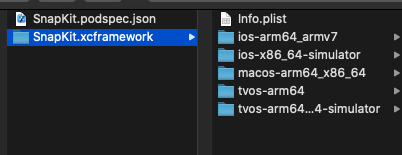

# cocoapods-framework

本插件可以帮助开发者快速的创建一个`OC`/`Swift`的`xcframework`。

## feat
- 支持 `Swift`/`Object-C` 生成 `framework`
- 支持 `Xcode` 新特性: `xcframework`
- 支持 `cocoapods` 绝大多数属性
- 支持 `subspec` 打包
## Installation

    $ gem install cocoapods-framework

## Usage
    $ pod framework NAME [SOURCE]
    更多请看
    $pod framework --help

## Q&A
### 而且本插件支持`apple`的全平台的`framework`创建,如下图



所以如果我们的库不是全平台都支持的话，可以选取支持的平台来打包,如下

```
Pod::Spec do |spec|
# @param  [Array<Symbol, String>] args
#         A tuple where the first value is the name of the platform,
#         (either `:ios` or `:osx`) and the second is the deployment
#         target.
      spec.platform = :osx, '10.8'
end
```
### 动态库和静态库

```
Pod::Spec do |spec|
    spec.static_framework = true
    #spec.static_framework = false
end
```

### 其他
请提`issue`,我会尽力更新。
